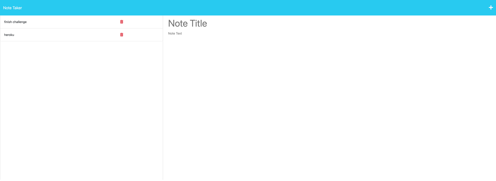

# Note Taker

## Description
This application will help you keep track of all your notes in one place. You will be able to create a new note and check back on it or delete when it is done. 

## Table of Contents 

- [Installation](#installation)
- [Usage](#usage)
- [Credits](#credits)
- [License](#license)
- [Questions](#questions)

## Installation 

No installation required.

## Usage

As soon as you load the page a home page will ask you to click the  button to start taking notes.

## Credits

The starter code was provided by the instructor and I got more information about delete route on tackoverflow.com

## License

 None

## Links

GitHub:https://github.com/caroHagg/Note-Taker

Heroku deployed:  https://pure-peak-10662.herokuapp.com/

